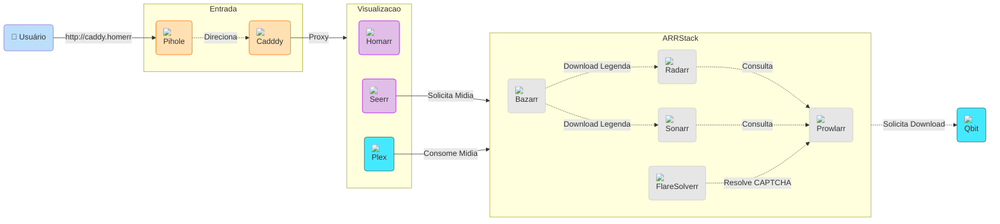

```mermaid
---
config:
  layout: dagre
---
flowchart LR
    User("👤 Usuário")
    Caddy("<img src=https://api.iconify.design/selfhst:caddy.svg?color=%23888888> Cadddy")
    Pihole("<img src=https://api.iconify.design/selfhst:pi-hole.svg?color=%23888888> Pihole")
    Homarr("<img src=https://api.iconify.design/selfhst:homarr.svg?color=%23888888> Homarr")
    Seerr("<img src=https://api.iconify.design/selfhst:overseerr.svg?color=%23888888> Seerr")
    Radarr("<img src=https://api.iconify.design/selfhst:radarr.svg?color=%23888888> Radarr")
    Sonarr("<img src=https://api.iconify.design/selfhst:sonarr.svg?color=%23888888> Sonarr")
    Prowlarr("<img src=https://api.iconify.design/selfhst:prowlarr.svg?color=%23888888> Prowlarr")
    Qbit("<img src=https://api.iconify.design/selfhst:qbittorrent.svg?color=%23888888> Qbit")
    Plex("<img src=https://api.iconify.design/selfhst:plex.svg?color=%23888888> Plex")
    Bazarr("<img src=https://api.iconify.design/selfhst:bazarr.svg?color=%236e6e6e> Bazarr")
    FlareSolverr("<img src=https://api.iconify.design/selfhst:flaresolverr.svg?color=%236e6e6e> FlareSolverr")

     Caddy:::entrada
     Pihole:::entrada
     Homarr:::visualizacao
     Seerr:::visualizacao
     Radarr:::arrstack
     Sonarr:::arrstack
     Prowlarr:::arrstack
     Bazarr:::arrstack
     FlareSolverr:::arrstack
     Qbit:::consumer
     Plex:::consumer
     
    classDef entrada fill:#FFE0B2,stroke:#FF6D00
    classDef visualizacao fill:#E1BEE7,stroke:#AA00FF
    classDef arrstack fill:#e6e6e6,stroke:#cccccc
    classDef consumer fill:#45e9ff,stroke:#1e636c
    style User fill:#BBDEFB

    User -- http://caddy.homerr --> Pihole
    Pihole -. Direciona .-> Caddy
    Caddy -- Proxy --> Visualizacao
    Seerr -- Solicita Midia --> ARRStack
    Radarr -. Consulta .-> Prowlarr
    Sonarr -. Consulta .-> Prowlarr
    ARRStack -. Solicita Download .-> Qbit
    Bazarr -. Download Legenda .-> Radarr
    Bazarr -. Download Legenda .-> Sonarr
    FlareSolverr -. Resolve CAPTCHA .-> Prowlarr
    Plex -- Consome Midia --> ARRStack

    subgraph Entrada
      Caddy
      Pihole
    end

    subgraph Visualizacao
      Homarr
      Seerr
      Plex
    end

    subgraph ARRStack
    direction LR
      Radarr
      Sonarr
      Prowlarr
      Bazarr
      FlareSolverr
    end
```