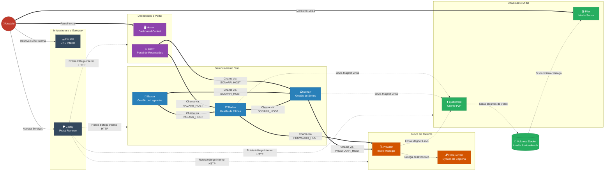

```mermaid
flowchart LR
    %% Direção baseada na leitura ocidental
    direction LR
    
    %% Usuário Final
    User((👤 Usuário))
    
    %% Camada 1: Gateway e Infraestrutura DNS
    subgraph Infra [Infraestrutura e Gateway]
        direction TB
        PiHole[🕳️ Pi-Hole <br/>DNS Interno]
        Caddy[🛡️ Caddy <br/>Proxy Reverso]
    end
    
    %% Camada 2: Interfaces de Entrada
    subgraph Front [Dashboards e Portal]
        direction TB
        Homarr[🖥️ Homarr <br/>Dashboard Central]
        Seerr[🍿 Seerr <br/>Portal de Requisições]
    end
    
    %% Camada 3: Gerenciamento Automático
    subgraph Gerenciamento [Gerenciamento *arrs]
        direction TB
        Sonarr[📺 Sonarr <br/>Gestão de Séries]
        Radarr[🎞️ Radarr <br/>Gestão de Filmes]
        Bazarr[📝 Bazarr <br/>Gestão de Legendas]
    end
    
    %% Camada 4: Indexadores e Bypass
    subgraph Indexacao [Busca de Torrents]
        direction TB
        Prowlarr[🔍 Prowlarr <br/>Index Manager]
        Flare[🔓 FlareSolverr <br/>Bypass de Captcha]
    end
    
    %% Camada 5: Download e Consumo Final
    subgraph Destino [Download e Mídia]
        direction TB
        Qbit[⬇️ qBittorrent <br/>Cliente P2P]
        Plex[🎬 Plex <br/>Media Server]
    end

    %% Volume Físico
    Storage[(📁 Volumes Docker <br/> /media & /downloads)]

    %% -------------------------------------
    %% FLUXOS E REQUESTS
    %% -------------------------------------
    
    %% Interação do Usuário
    User -->|Resolve Rede Interna| PiHole
    User -->|Acessa Serviços| Caddy
    User ==>|Painel Inicial| Homarr
    User ==>|Consome Mídia| Plex

    %% Comunicação explícita via Variáveis de Ambiente (ENV)
    Seerr == "Chama via RADARR_HOST" ==> Radarr
    Seerr == "Chama via SONARR_HOST" ==> Sonarr
    
    Bazarr == "Chama via RADARR_HOST" ==> Radarr
    Bazarr == "Chama via SONARR_HOST" ==> Sonarr
    
    Radarr == "Chama via SONARR_HOST" ==> Sonarr
    Radarr == "Chama via PROWLARR_HOST" ==> Prowlarr
    
    Sonarr == "Chama via PROWLARR_HOST" ==> Prowlarr

    %% Comunicação Implícita e Fluxo Funcional
    Caddy -.->|Roteia tráfego interno HTTP| Front & Gerenciamento & Indexacao & Destino
    
    Prowlarr -.->|Delega desafios web| Flare
    
    %% Fluxo de Arquivos e Torrents
    Prowlarr -.->|Envia Magnet Links| Qbit
    Radarr -.->|Envia Magnet Links| Qbit
    Sonarr -.->|Envia Magnet Links| Qbit
    
    Qbit -.->|Salva arquivos de vídeo| Storage
    Storage -.->|Disponibiliza catálogo| Plex
    
    %% Cores para visualização
    classDef infra fill:#34495e,stroke:#2c3e50,color:#fff;
    classDef front fill:#8e44ad,stroke:#732d91,color:#fff;
    classDef media fill:#2980b9,stroke:#2471a3,color:#fff;
    classDef index fill:#d35400,stroke:#ba4a00,color:#fff;
    classDef down fill:#27ae60,stroke:#1e8449,color:#fff;
    classDef user fill:#c0392b,stroke:#922b21,color:#fff;

    class PiHole,Caddy infra;
    class Homarr,Seerr front;
    class Sonarr,Radarr,Bazarr media;
    class Prowlarr,Flare index;
    class Qbit,Plex,Storage down;
    class User user;
```